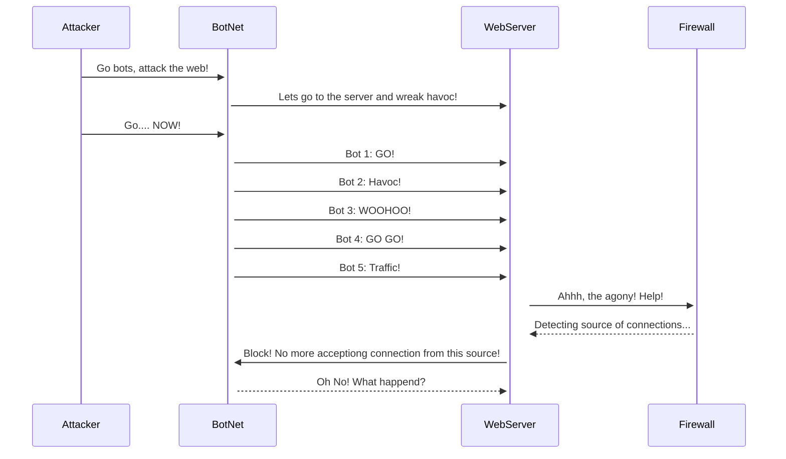

## Distributed Denial of Service Attack

### Documentation
Steps into a DDos Attack! 
1. Attacker sends instructions and commands to the BotNet
2. BotNet, with the command of the Attacker will connect to the WebServer and cause traffic
3. WebServer, oerwhelmed by the ammount of traffic can't respond to real connections by users
4. The firewall however can stop connections from specific sources.
5. Firewall closes connection from the BotNet, stopping the Attack
